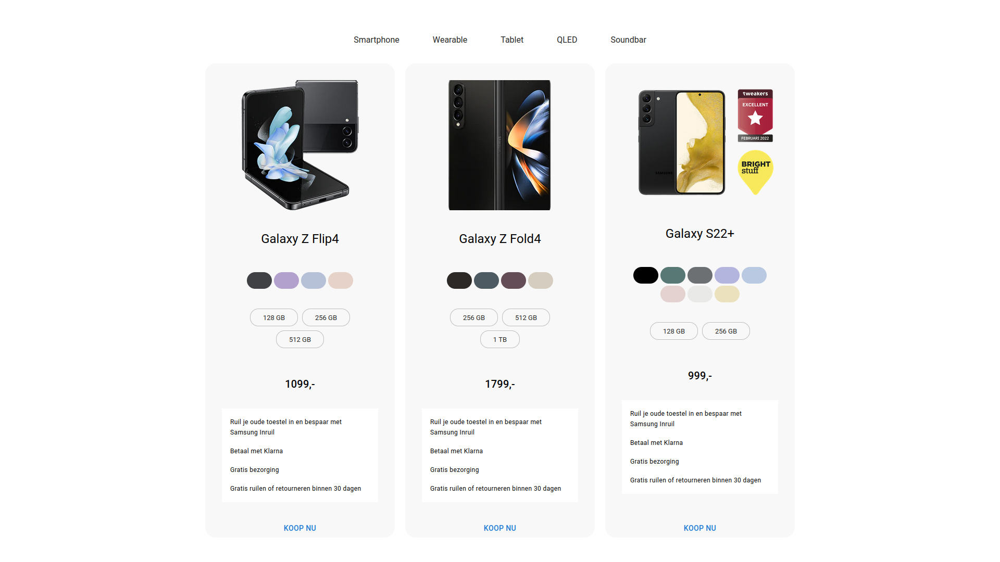

# Samsung product app

## Installation
```bash
git clone https://github.com/Laphatradap/lp-assignment-samsung-product-app.git
cd lp-assignment-samsung-product-app
npm install
npm start
```
## Technologies used
- React
- Redux-toolkit
- Typescript
- Styled components
  
## Features implemented
- A landing page that displays samsung products grouped by category with filter functionality.
- User can select desired color and memory, price and product image will update accordingly.

## To dos
- Enrich product cards with more information (ratings)
- Deal with faulty image url, missing price data
- Configure chip options to keep selected state
- Addd `Buy now` feature
- Make it mobile-friendly

## Screenshots



## Create React App
- This project was bootstrapped with [Create React App](https://github.com/facebook/create-react-app), using the [Redux](https://redux.js.org/) and [Redux Toolkit](https://redux-toolkit.js.org/) TS template.
